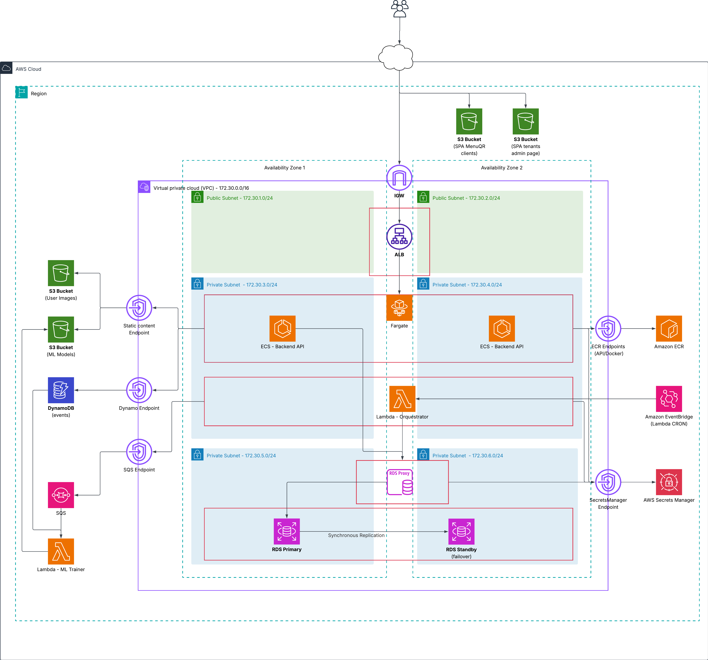

# Cloud Computing - TP3 - Terraform
### Grupo 3 - 2026Q1 - ITBA

## Introducción

MenuQR es una aplicación multi-tenant para el manejo de menus digitales.  
Cada restaurante administra su carta desde un panel web y los clientes acceden al menú mediante un código QR desde su celular,
Además, se recompilan datos de interacción que se usan para analitica y entrenamiento de modelos de recomendaciones personalizados a cada restaurante

## Arquitectura



## Requerimientos

- Terraform ≥ 1.8.5, AWS CLI, Docker, Maven, Node.js
- Cuenta AWS con rol **LabRole**

Aclaración: Los scripts fueron probados en Linux, aunque deberian funcionar también en MAC o en Windows mediante el uso de WSL

## Scripts (`terraform/scripts/`)

| Script | Uso                                                             |
|--------|-----------------------------------------------------------------|
| `deploy.sh` | **Completo:** Lambdas → `terraform apply` → backend → frontends |
| `deploy-backend.sh` | Buildea imagen y sube a ECS                                     |
| `deploy-frontends.sh` | Build Vite + sync S3                                            |

El empaquetado de Lambdas ocurre en `ml-training/scripts/build_lambda_dists.sh` (lo invoca `deploy.sh`).

## Instrucciones de Ejecución
### Paso a paso

```bash
bash ml-training/scripts/build_lambda_dists.sh
cd terraform && terraform init && terraform apply
bash terraform/scripts/deploy-backend.sh
bash terraform/scripts/deploy-frontends.sh
```

### Alternativa - 

```bash
bash terraform/scripts/deploy.sh
```
### Outputs útiles

```bash
terraform output backend_api_url
terraform output frontend_admin_website_url
terraform output frontend_menu_website_url
```

### Justificación del uso de scripts Bash

La subida de imagenes a ECR y de archivos de los sitios web a los S3 se realiza mediante scripts. 
Si bien esto tecnicamente podria hacerse mediante terraform, no lo consideramos una buena practica, puesto que Terraform está 
orientado al aprovisionamiento y gestión declarativa de infraestructura, no al build ni despliegue de artefactos de aplicación.

Separar estas responsabilidades permite:

- Mantener los terraform apply idempotentes y más predecibles;
- Evitar que cambios frecuentes de código generen cambios innecesarios en la infraestructura;
- Desacoplar el ciclo de vida de la aplicación del de la infraestructura;

Por este motivo, Terraform se utiliza únicamente para crear y configurar la infraestructura necesaria, mientras que los scripts Bash se encargan de:

- Construir y subir imágenes Docker a ECR;
- Empaquetar y desplegar Lambdas;
- Compilar y sincronizar los frontends en los buckets S3 correspondientes;

## Terraform

### Módulos propios

| Módulo | Uso                                          |
|--------|----------------------------------------------|
| `modules/python-lambda` | Lambda desde directorio (zip con `archive_file`) |
| `modules/s3-private` | Buckets privados versionados                 |
| `modules/s3-public-website` | SPAs con website hosting                     |

### Módulos externos

| Módulo | Uso |
|--------|-----|
| `terraform-aws-modules/vpc` | VPC, subredes, NAT |
| `terraform-aws-modules/rds-proxy` | RDS Proxy |

### Funciones

| Función | Ejemplo en el repo |
|---------|-------------------|
| `slice` | `locals.tf` — subredes / AZs |
| `cidrsubnets` | `locals.tf` — CIDRs por capa |
| `toset` | `s3.tf`, `vpc_endpoint.tf` — `for_each` |
| `jsonencode` | `ecs.tf` — task definition (contenedor) |
| `coalesce` | `modules/python-lambda` — VPC SG |

### Meta-argumentos

| Meta-argumento | Ejemplo |
|----------------|---------|
| `for_each` | Buckets S3, gateway VPC endpoints |
| `depends_on` | ECS service → ALB listener; políticas S3 |
| `lifecycle` | Security groups (`create_before_destroy`); ECS `ignore_changes` en `desired_count` |
| `dynamic` | Bloque `vpc_config` en módulo Lambda |

