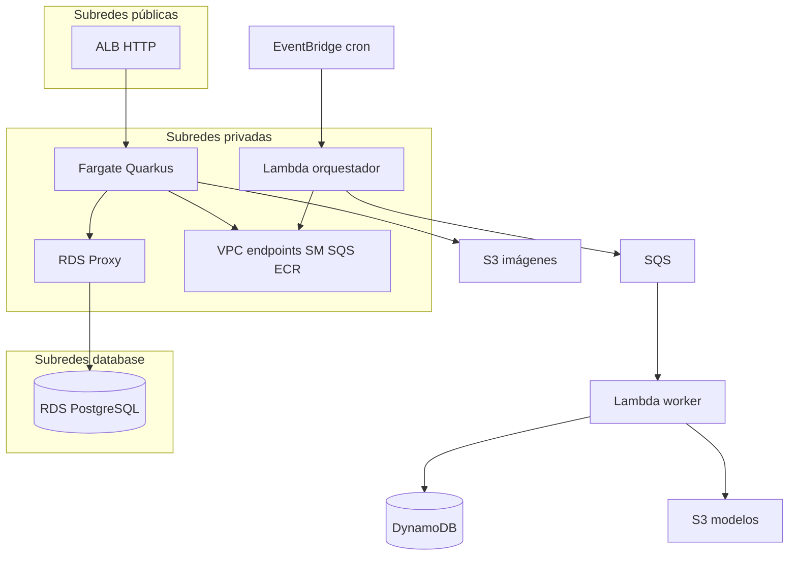

# Cloud Computing - TP3 - Terraform
### Grupo 3 - 2026Q1 - ITBA

## Introducción

Infraestructura de **MenuQR** en AWS definida con Terraform: VPC, RDS + Proxy, ECS Fargate (API Quarkus), S3, DynamoDB, Lambdas ML (EventBridge → orquestador → SQS → worker) y VPC endpoints.

## Arquitectura



Frontends estáticos (admin / menú) en buckets S3 website; despliegue con `scripts/deploy-frontends.sh`.

## State remoto (S3 + DynamoDB)

El state **no** debe commitearse. Se usa backend S3 con bloqueo en DynamoDB.

### Primera vez

```bash
# Desde la raíz del repo
bash terraform/scripts/terraform-init-remote.sh
```

Eso aplica `terraform/bootstrap/` (bucket + tabla de locks), genera `terraform/backend.hcl` y ejecuta `terraform init -backend-config=backend.hcl` (migra state local si existía).

### Siguientes veces

```bash
cd terraform
terraform init -backend-config=backend.hcl
terraform plan
terraform apply
```

Plantilla manual: `backend.hcl.example`.

## Instructivo de ejecución completo

### Prerrequisitos

- Terraform ≥ 1.8.5, AWS CLI, Docker, Maven, Node.js
- Cuenta AWS con rol **LabRole** (lab; no se crean roles IAM propios)
- Credenciales: `aws sts get-caller-identity`

### 1. State remoto

```bash
bash terraform/scripts/terraform-init-remote.sh
```

### 2. Artefactos Lambda

```bash
bash ml-training/scripts/build_lambda_dists.sh
```

### 3. Infraestructura

```bash
cd terraform
terraform plan -var-file=terraform.tfvars
terraform apply -var-file=terraform.tfvars
```

### 4. Aplicación

```bash
bash scripts/deploy-backend.sh
bash scripts/deploy-frontends.sh
```

O todo junto (sin `terraform apply`): `bash scripts/deploy.sh`

### Outputs útiles

```bash
terraform output backend_api_url
terraform output frontend_admin_website_url
terraform output frontend_menu_website_url
```

## Terraform

### Módulos propios

| Módulo | Uso |
|--------|-----|
| `modules/python-lambda` | Lambda desde directorio (zip con `archive_file`) |
| `modules/s3-private` | Buckets privados versionados |
| `modules/s3-public-website` | SPAs con website hosting |

### Módulos externos

| Módulo | Uso |
|--------|-----|
| `terraform-aws-modules/vpc` | VPC, subredes, NAT |
| `terraform-aws-modules/rds-proxy` | RDS Proxy |

### Funciones (≥4)

| Función | Ejemplo en el repo |
|---------|-------------------|
| `slice` | `locals.tf` — subredes / AZs |
| `cidrsubnets` | `locals.tf` — CIDRs por capa |
| `lower` / `replace` | `locals.tf` — `name_prefix` |
| `toset` | `s3.tf`, `vpc_endpoint.tf` — `for_each` |
| `jsonencode` | `ecs.tf` — task definition |
| `coalesce` | `modules/python-lambda` — VPC SG |

### Meta-argumentos (≥3)

| Meta-argumento | Ejemplo |
|----------------|---------|
| `for_each` | Buckets S3, gateway VPC endpoints |
| `depends_on` | ECS service → ALB listener; políticas S3 |
| `lifecycle` | Security groups (`create_before_destroy`); ECS `ignore_changes` en `desired_count` |
| `dynamic` | Bloque `vpc_config` en módulo Lambda |

## Lab

- IAM: solo **LabRole** (Lambda, ECS, RDS Proxy).
- Sin CloudWatch Logs en ECS (por diseño).
- `GetAuthorizationToken` de ECR puede usar NAT brevemente; capas de imagen vía VPC endpoint.

## Pipeline CI

Ver `.github/workflows/terraform.yml` (si está presente en el repo): `init`, `validate`, `plan` en pull requests.
